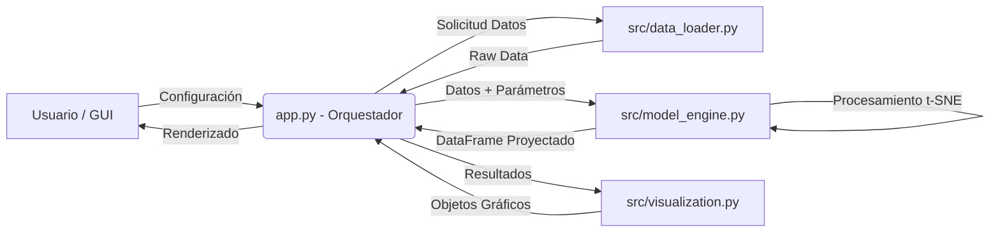

# 🔬 Interactive t-SNE Explorer: Dimensionality Reduction


## 📖 Descripción del Proyecto

Esta aplicación es una herramienta interactiva de **Machine Learning** diseñada para visualizar la reducción de dimensionalidad en datos complejos. Utiliza el algoritmo **t-SNE** (t-Distributed Stochastic Neighbor Embedding) sobre el dataset clásico de dígitos manuscritos (UCI ML Digits).

El objetivo es permitir a usuarios técnicos y no técnicos explorar cómo los algoritmos de aprendizaje de variedades transforman un espacio de 64 dimensiones en un plano 2D observable, facilitando la identificación de clústeres y patrones ocultos.

---

## 🧠 El Algoritmo: t-SNE

**t-SNE** es una técnica de aprendizaje no supervisado no lineal. A diferencia de PCA (que es lineal), t-SNE es excelente para visualizar estructuras de alta dimensión preservando la topología local.

### Fundamento Matemático
1.  **Similitud en Alta Dimensión ($P$):** Se calcula la probabilidad condicional de similitud entre puntos basada en una distribución Gaussiana.
2.  **Similitud en Baja Dimensión ($Q$):** Se utiliza una distribución **t-Student** (de colas pesadas) en el espacio 2D. Esto mitiga el "problema de aglomeración" (crowding problem).
3.  **Función de Coste:** El algoritmo minimiza la Divergencia de Kullback-Leibler (KL) entre ambas distribuciones mediante Gradiente Descendente:

$$KL(P||Q) = \sum_i \sum_j p_{ij} \log \frac{p_{ij}}{q_{ij}}$$

---

## 📊 El Dataset: Digits

Utilizamos el dataset `sklearn.datasets.load_digits`.

* **Muestras:** 1,797 vectores.
* **Dimensionalidad:** 64 features (imágenes aplanadas de 8x8 píxeles).
* **Clases:** 10 (Dígitos 0-9).
* **Valores:** Enteros de 0 a 16 (escala de grises).

---

## 🛠️ Stack Tecnológico

| Componente | Librería | Propósito |
| :--- | :--- | :--- |
| **Frontend** | `Streamlit` | Interfaz de usuario reactiva y widgets de control. |
| **ML Core** | `Scikit-Learn` | Implementación de t-SNE y carga de datos. |
| **Data Frame** | `Pandas` | Manipulación y estructuración de proyecciones. |
| **Visualización** | `Plotly Express` | Gráficos de dispersión interactivos (zooming, tooltips). |
| **Renderizado** | `Matplotlib` | Visualización estática de las matrices de imágenes crudas. |

---

## 🏗 Arquitectura del Sistema

El proyecto sigue el principio de diseño **Separation of Concerns (SoC)**. La lógica de negocio, la ingestión de datos y la visualización están desacopladas, permitiendo modificar componentes individuales sin afectar la estabilidad del sistema completo.

### Diagrama de Flujo de Datos


---

## 🚀 Instalación y Uso

Sigue estos pasos para ejecutar el proyecto en tu entorno local:

### 1. Clonar el repositorio
```bash
git clone [https://github.com/TU_USUARIO/tsne-explorer.git](https://github.com/TU_USUARIO/tsne-explorer.git)
cd tsne-explorer
```

### 2. Crear Entorno Virtual
```bash
python -m venv venv
source venv/bin/activate  
venv\Scripts\activate
```
### 3. Instalar Dependencias
```bash
pip install -r requirements.txt
```

---
### ⚙️ Explicación de Parámetros del Algoritmo

El algoritmo **t-SNE** es sensible a sus hiperparámetros. A continuación se detalla qué controla cada variable configurada en la barra lateral:

#### 1. Perplexity (Perplejidad)
**Rango seleccionado:** `5 - 50`

Es, quizás, el parámetro más importante. Matemáticamente, es una medida del número efectivo de vecinos cercanos que cada punto considera.
* **¿Qué hace?** Controla el equilibrio entre prestar atención a los aspectos **locales** de los datos frente a los **globales**.
* **Perplexity Baja (5-10):** El algoritmo se enfoca solo en los vecinos inmediatos. Esto tiende a romper los clústeres en grupos pequeños y fragmentados.
* **Perplexity Alta (30-50):** El algoritmo considera un vecindario más amplio. Preserva mejor la topología global, pero puede fusionar grupos que deberían estar separados.
* *Analogía:* Es como ajustar el "zoom" de una cámara. ¿Quieres ver los detalles de una sola hoja (baja) o el bosque completo (alta)?

#### 2. Iteraciones (n_iter)
**Rango seleccionado:** `250 - 2000`

Define el número máximo de pasos que el algoritmo ejecutará para optimizar la posición de los puntos.
* **¿Qué hace?** t-SNE comienza con los puntos en posiciones aleatorias y los mueve paso a paso para minimizar el error (Divergencia KL).
* **Pocas iteraciones (< 250):** El modelo puede detenerse antes de converger. Los resultados parecerán una "bola" de puntos desorganizada sin clústeres definidos.
* **Muchas iteraciones (> 1000):** Asegura que el modelo encuentre una configuración estable. Una vez que se alcanza la estabilidad, más iteraciones no cambian el resultado, solo consumen tiempo de cómputo.

#### 3. Learning Rate (Tasa de Aprendizaje)
**Valor seleccionado:** `100` (u opciones: 10, 50, 200)

Controla el tamaño del "paso" que da el algoritmo en cada actualización durante la optimización del gradiente descendente.
* **¿Qué hace?** Determina qué tan rápido se mueven los puntos hacia su posición ideal en cada iteración.
* **Tasa Baja (10):** Los puntos se mueven muy lentamente. Puede requerir muchísimas iteraciones para llegar a una solución y corre el riesgo de quedarse atascado en óptimos locales.
* **Tasa Alta (200+):** Los puntos se mueven agresivamente. Pueden "saltarse" la posición ideal, resultando en una visualización donde todos los puntos parecen equidistantes y dispersos (como una nube uniforme).
* **Valor Típico:** Para datasets de este tamaño, valores entre `100` y `200` suelen ofrecer el mejor equilibrio.